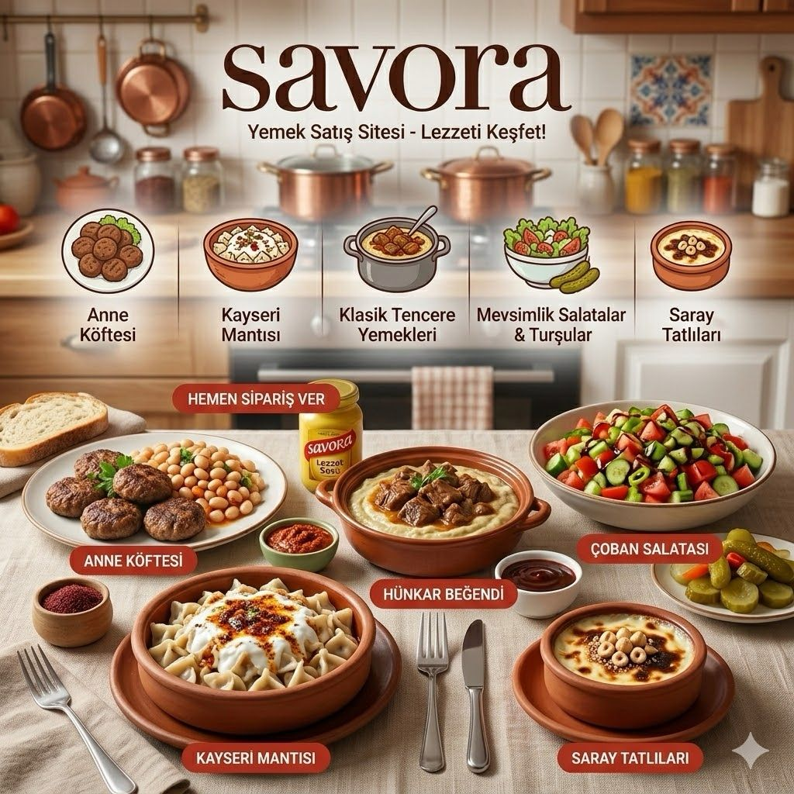

# SAVORA
Evden gönlünüzce yemek satışı yapabileceğiniz, güvenilir bir platform.

## 🍲 Proje Hakkında (Savora)
Savora, evinde yemek yapan yetenekli aşçılar ile lezzetli ev yemeği özlemi çeken kullanıcıları güvenilir bir ortamda buluşturan yenilikçi bir yemek satış platformudur. Amacımız, evden gönlünüzce yemek satışı yapabileceğiniz ve sipariş verebileceğiniz dijital bir pazar yeri yaratmaktır.

## Proje Bağlantıları
* **Rest API Adresi:** https://raw.githubusercontent.com/alarakokbudak/savora-yemek-satis/refs/heads/main/SavoraAPI.yaml
* **Web Ön Yüz Adresi:**

## 👥 Geliştirici Ekip
Bu proje, aşağıdaki 4 kişilik geliştirici ekip tarafından tasarlanıp kodlanmaktadır:
* Alara Kökbudak
* İrem Nur Yaslı
* Sena Maral
* Sudegül Öçal

## 📌 Ana Gereksinimler ve İşlevler
Sistemimiz, Alıcı ve Satıcı rolleri üzerinden aşağıdaki temel gereksinimleri ve CRUD (Oluşturma, Okuma, Güncelleme, Silme) işlemlerini sağlamaktadır:
* **Kullanıcı İşlemleri:** Güvenli kayıt olma, giriş yapma ve profil yönetimi.
* **Menü ve Yemek Yönetimi:** Satıcıların sisteme yeni yemekler eklemesi, porsiyon/fiyat güncellemesi ve yayından kaldırması.
* **Sipariş Yönetimi:** Alıcıların ürünleri sepete eklemesi, sipariş oluşturması ve sipariş durumunu (hazırlanıyor, yolda vb.) takip etmesi.
* **Listeleme ve Keşfetme:** Satışta olan aktif yemeklerin kullanıcılar tarafından görüntülenmesi.

## 🔗 Temel API Yolları (Endpoints)
Projenin arka planında iletişim kuracağımız temel API yollarından bazıları şunlardır:
* `GET /api/yemekler` : Satıştaki tüm aktif yemekleri listeler.
* `POST /api/yemekler` : Satıcının sisteme yeni bir yemek eklemesini sağlar.
* `PUT /api/yemekler/{id}` : Satıcının mevcut bir yemeğin bilgilerini güncellemesini sağlar.
* `DELETE /api/yemekler/{id}` : İlgili yemeği menüden siler.
* `POST /api/siparisler` : Alıcının yeni bir sipariş oluşturmasını sağlar.

## Dokümantasyon
Proje dokümantasyonuna aşağıdaki linklerden erişebilirsiniz:
1. [Gereksinim Analizi](Gereksinim-Analizi.md)
2. [REST API Tasarımı](API-Tasarimi.md)
3. [REST API](SavoraAPI.yaml)
4. [Web Front-End](WebFrontEnd.md)
5. [Mobil Front-End](MobilFrontEnd.md)
6. [Mobil Backend](MobilBackEnd.md)
7. [Video Sunum](Sunum.md)
